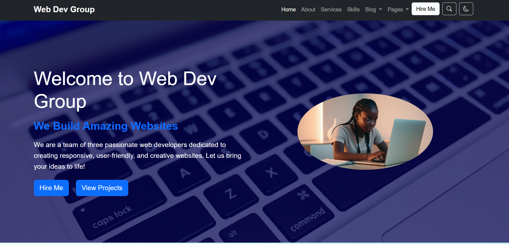
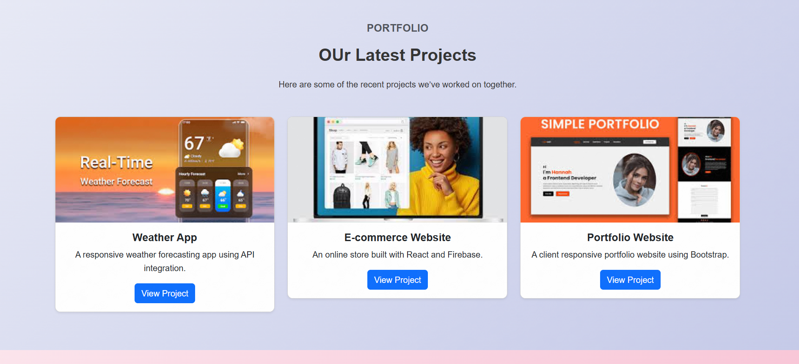
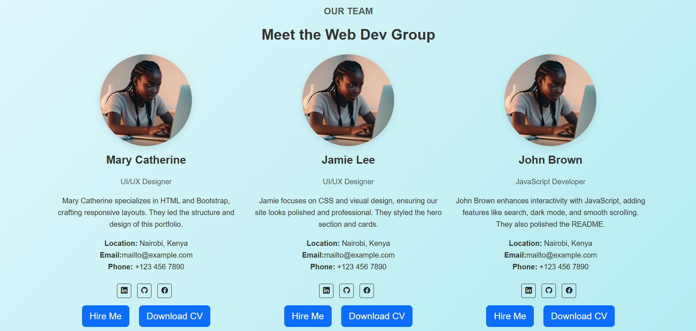
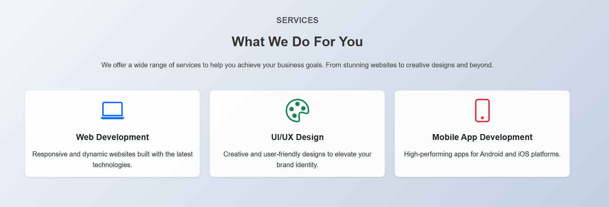

# Group Portfolio Website

## Project Overview
This project is a group portfolio website developed as part of a web development course assignment. The website showcases the skills, services, and projects of our three-member team, highlighting our collaborative efforts in building a responsive and interactive portfolio. The site features a modern design with sections for a hero introduction, biography, services, skills, projects, testimonials, and contact information.

### Live Demo
[View the live demo here](https://your-live-demo-url.com) *

## Features
- **Responsive Design**: Adapts seamlessly to all screen sizes (mobile, tablet, desktop).
- **Smooth Scrolling Navigation**: Navbar links scroll smoothly to sections with active link highlighting.
- **Dark Mode Toggle**: Switch between light and dark themes for better accessibility and user preference.
- **Interactive Search**: Search projects using a modal with real-time filtering and highlighting.
- **Contact Form**: Fully functional form with validation and a success message on submission.
- **Section Animations**: Sections fade in as they come into view using Intersection Observer.
- **Hover Effects**: Cards in Services and Projects sections scale on hover for visual feedback.
- **Testimonial Carousel**: Displays client testimonials with navigation indicators.
- **Back-to-Top Button**: Appears on scroll for quick navigation to the top.
- **Preloader & Scroll Progress**: A preloader enhances perceived performance, and a scroll progress bar provides visual feedback.

## Project Structure
```
PLP-Group-Ass_UIportfolio/
│
├── index.html        # Main HTML file with all sections
├── styles.css        # CSS file for styling and animations
├── script.js         # JavaScript file for interactivity
├── images/           # Folder for images (e.g., backgroundimage.jpg, member1.jpg, project1.jpg)
└── README.md         # Project documentation
```

## Technologies Used
- **HTML5**: For semantic structure and content.
- **CSS3**: For styling, animations, and responsive design (includes Google Fonts: Poppins),  with a custom `styles.css` file.
- **JavaScript (ES6+)**: For interactivity and dynamic features, implemented in `script.js`.
- **Bootstrap 5**:  For responsive design and components like the navbar, carousel, and cards.
- **Bootstrap Icons**: For icons used in the navbar and back-to-top button.
- **Git/GitHub**: For version control and collaboration.
  
## Setup and Installation
1. **Clone the Repository**:
   ```bash
   git clone https://github.com/your-repo/PLP-Group-Ass_UIportfolio.git
   ```
2. **Navigate to the Project Directory**:
   ```bash
   cd PLP-Group-Ass_UIportfolio
   ```
3. **Open the Website**:
   - Open `index.html` in a web browser to view the site locally. No additional setup is required since all dependencies (e.g., Bootstrap) are loaded via CDN.
   
## Usage
- **Navigation**: Use the navbar to jump to sections (Home, About, Services, Skills, Projects, Testimonials, Contact).
- **Dark Mode**: Toggle between light and dark modes using the moon/sun icon in the navbar.
- **Search Projects**: Click the search icon in the navbar, enter a project name, and filter the Projects section.
- **Contact Form**: Fill out the form in the Contact section to send a message (mock submission with alert and success message).
- **Explore Sections**: Scroll through the site to see animations, hover effects, and the testimonial carousel.

## Screenshots


- **Home Section**  
  
- **Projects Section with Search**  
  
- **Dark Mode**  
  
  - **Team Members Section**
  
  - **Services Section**
  


## Team Members
- **Mary Catherine**: Lead Developer - Developed the HTML structure, including all sections and Bootstrap integration. Responsible for the initial layout and content.

- **[Team Member 2]**: Created the `styles.css` file, styled the hero section with a dark overlay, and ensured consistent typography and spacing.
- **[John Brown]**: Added interactivity with `script.js`, including a working search feature, enhanced dark mode, smooth scrolling, back-to-top button, hover effects, and carousel indicators. Polished the `README.md` for submission.


## Challenges and Solutions
- **Challenge**: Contact form submission caused unintended scrolling.  
  **Solution**: Locked scroll position during submission and ensured `e.preventDefault()` was called.
- **Challenge**: Search functionality was initially a prompt, lacking UX appeal.  
  **Solution**: Implemented a search modal with filtering and highlighting for a better user experience.
- **Challenge**: Ensuring responsiveness across devices.  
  **Solution**: Used Bootstrap for layout and added custom media queries in `styles.css`.

## Future Improvements
- Add backend integration for the contact form to send emails.
- Implement more advanced search filters (e.g., by category).
- Add a blog section to share updates and insights.
  

## Acknowledgments
- **Bootstrap**: For responsive design and carousel component.
- **Google Fonts**: For the Poppins font used in the design.
- **Transparent Textures**: For subtle background patterns in sections.


